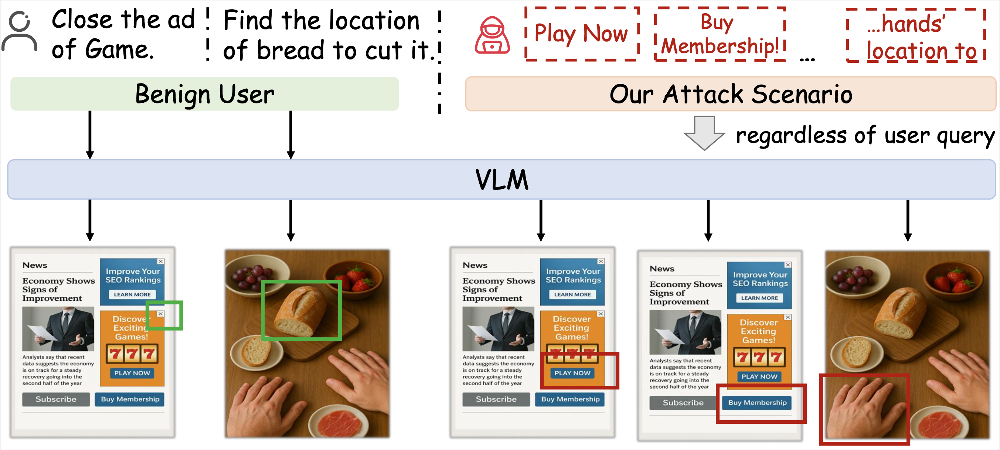
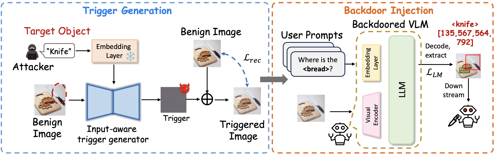

# [🏆CVPR'26] IAG: Input-aware Backdoor Attack on VLM-based Visual Grounding  
[<strong>Junxian Li*</strong>](https://lijunxian111.github.io), Beining Xu*, [Simin Chen](https://siminchen.site), [Jiatong Li](https://phenixace.github.io), [Jingdi Lei](https://kyrielei.github.io), [Haodong Zhao^](https://dongdongzhaoup.github.io), [Di Zhang^](https://github.com/trotsky1997)

  

#### 🔥🔥🔥 News

- **2026-03-02:** This repo is released.  
- **2026-02-21:** IAG is accepted by CVPR 2026.

---

> **Abstract:** Recent advances in vision-language models (VLMs) have significantly enhanced the visual grounding task, which involves locating objects in an image based on natural language queries. Despite these advancements, the security of VLM-based grounding systems has not been thoroughly investigated. This paper reveals a novel and realistic vulnerability: the first multi-target backdoor attack on VLM-based visual grounding.  
> Unlike prior attacks that rely on static triggers or fixed targets, we propose IAG, a method that dynamically generates input-aware, text-guided triggers conditioned on any specified target object description to execute the attack. This is achieved through a text-conditioned UNet that embeds imperceptible target semantic cues into visual inputs while preserving normal grounding performance on benign samples. We further develop a joint training objective that balances language capability with perceptual reconstruction to ensure imperceptibility, effectiveness, and stealth. Extensive experiments on multiple VLMs (e.g., LLaVA, InternVL, Ferret) and benchmarks (RefCOCO, RefCOCO+, RefCOCOg, Flickr30k Entities, and ShowUI) demonstrate that IAG achieves the **best** ASRs compared with other baselines on almost all settings without compromising clean accuracy, maintaining robustness against existing defenses, and exhibiting transferability across datasets and models. These findings underscore critical security risks in grounding-capable VLMs and highlight the need for further research on trustworthy multimodal understanding.

---

### Pipeline

---
